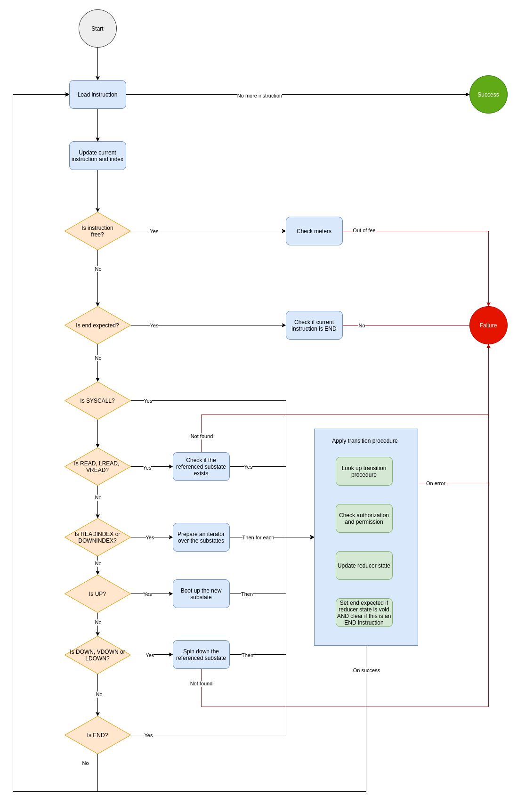

# Transaction Validation

This doc presents the transaction validation rules by Radix Engine, which includes:
- Transaction limit check
- Stateless validation
- Stateful validation (including transaction fee check)

For transaction parsing, please check [this doc](./parsing.md).

## Transaction Limit

- The maximum number of signatures must be less or equal to `50` per round proposal
- The maximum transaction size is `1024 * 1024` bytes.

## Stateless Validation

Stateless validation checks if all transaction instructions are legit based on static rules.

If no violation is found, a list of parsed instructions, an optional message data, an optional signature and any feature flags should be returned.

### Per Instruction

#### Instruction Rules

- `HEADER`: 
   * Can appear **at most once** per transaction and must be **the first** instruction if exists;
   * The `version` must be `0x00`;
   * The `flags` must be `0x00` (default) or `0x01` (with resource allocation/de-allocation disabled).
- `SIG`: 
   * Can appear **at most once** per transaction and must be **the last** instruction if exists.
- `MSG`: 
   * Can appear **at most once** per transaction.
- `LDOWN` and `LREAD`:
   * The `index` operand must be less than the number of `UP` instructions before this instruction.
- `DOWNALL`:
   * The `class_id` operand must be one of the supported substate type.
- `DOWNINDEX`:
   * The `prefix` length should be less than 10 and the first byte must be a valid `class_id`.
- `SYSCALL`:
   * The `calldata` operand must be one of the following:
      - `0x00 + u256`: Deposit into the fee reserve
      - `0x01 + u256`: Withdraw from the fee reserve

#### Substate Static Check

If a substate is created by one instruction, its content must be statically checked:

| **Substate Type**                 | **Static Rules**                                                                                                                               |
|-----------------------------------|------------------------------------------------------------------------------------------------------------------------------------------------|
| `UNCLAIMED_READDR`                | <ul><li>None</li></ul>                                                                                                                         |
| `ROUND_DATA`                      | <ul><li>None</li></ul>                                                                                                                         |
| `EPOCH_DATA`                      | <ul><li>None</li></ul>                                                                                                                         |
| `TOKEN_RESOURCE`                  | <ul><li>None</li></ul>                                                                                                                         |
| `TOKEN_RESOURCE_METADATA`         | <ul><li>`description`: max 200 characters</li><li>`icon_url`: must be of OWASP URL format</li><li>`url`: must be of OWASP URL format</li></ul> |
| `TOKENS`                          | <ul><li>`amount`: must be non-zero</li><li>`owner`: must of an account address</li></ul>                                                       |
| `PREPARED_STAKE`                  | <ul><li>`amount`: must be non-zero</li></ul>                                                                                                   |
| `STAKE_OWNERSHIP`                 | <ul><li>`amount`: must be non-zero</li></ul>                                                                                                   |
| `PREPARED_UNSTAKE`                | <ul><li>None</li></ul>                                                                                                                         |
| `EXITING_STAKE`                   | <ul><li>None</li></ul>                                                                                                                         |
| `VALIDATOR_META_DATA`             | <ul><li>`url`: must be of OWASP URL format</li></ul>                                                                                           |
| `VALIDATOR_STAKE_DATA`            | <ul><li>None</li></ul>                                                                                                                         |
| `VALIDATOR_BFT_DATA`              | <ul><li>None</li></ul>                                                                                                                         |
| `VALIDATOR_ALLOW_DELEGATION_FLAG` | <ul><li>None</li></ul>                                                                                                                         |
| `VALIDATOR_REGISTERED_FLAG_COPY`  | <ul><li>None</li></ul>                                                                                                                         |
| `PREPARED_REGISTERED_FLAG_UPDATE` | <ul><li>None</li></ul>                                                                                                                         |
| `VALIDATOR_RAKE_COPY`             | <ul><li>None</li></ul>                                                                                                                         |
| `PREPARED_RAKE_UPDATE`            | <ul><li>`current_rake_percentage`: must be in [0, 10000]</li><li>`next_rake_percentage`: must be in [0, 10000]</li></ul>                                                                                                                         |
| `VALIDATOR_OWNER_COPY`            | <ul><li>None</li></ul>                                                                                                                         |
| `PREPARED_VALIDATOR_OWNER_UPDATE` | <ul><li>`owner`: must be an account address</li></ul>                                                                                                                         |

#### Signature Validation

The signature from `SIG` instructions must be verified against the hash of all instructions before this instruction and a valid public key should be computed.

### Per Instruction Group

Instructions are organized into groups, by splitting with `END` instruction.

Each instruction group must contain at least one state update instruction, which can be `UP`, `VDOWN`, `VDOWNARG`, `DOWN`, `LDOWN`, `DOWNALL` and `DOWNINDEX`.

Each transaction must include at least one instruction group and incomplete instruction group is not allowed (not ended).

## Stateful Validation

After a transaction passes the stateless validation, it's validated against the ledger state, which consists of:
- **Transactions:** Committed transactions, indexed by transaction ID.
- **Substates:** A map of substates, indexed by substate ID.
- **Proofs:** Block headers, containing accumulator hashes, validator set and quorum certificate.

The program that enforces stateful validation is called Radix Constraint Machine (CM). Constraint machines are stateful and can run at different permission levels.

### Permission Levels

Permission levels are designed to allow/disallow certain actions.

| **Level**    | **Permissions Allowed**                                                                                                                                                                                               |
|--------------|-----------------------------------------------------------------------------------------------------------------------------------------------------------------------------------------------------------------------|
| `SYSTEM`     | <ul><li>To allocate native tokens</li><li>To skip transaction signature validation</li><li>To skip transaction fee validation</li><li>To conduct hard-forks when necessary (e.g. on safety/liveness breaks)</li></ul> |
| `SUPER_USER` | <ul><li>To update system epoch and view state</li></ul>                                                                                                                                                               |
| `USER`       | <ul><li>To conduct user transactions, like token transfer, stake and unstake</li></ul>                                                                                                                                |

Note that a higher-tier permission level is allowed for all actions granted by a lower-tier level.

### Validation State

Validation state is the internal state of the constraint machine, which includes:

| **Variable**                  | **Description**                                                                       |
|-------------------------------|---------------------------------------------------------------------------------------|
| `procedures`                  | All registered state transition procedures, ***immutable***                           |
| `virtual_substate_predicate`  | A predicate which tells if a particle can be virtually shut down, ***immutable***     |
| `cm_store`                    | A reference to the substate storage, ***immutable***                                  |
| `permission_level`            | The permission level, ***immutable***                                                 |
| `signer`                      | The transaction signer, ***immutable*** and ***optional***                            |
| `resource_mint_burn_disabled` | A flag indicates if resource allocation and deallocation is disabled, ***immutable*** |
| `current_instruction`         | The current instruction                                                               |
| `current_index`               | The index of the current instruction                                                  |
| `up_instruction_count`        | The number of `UP` instruction processed so far                                       |
| `reducer_state`               | The current reducer state                                                             |
| `end_expected`                | A flag indicates if an `END` instruction is expected                                  |
| `local_up_substates`          | A map of substates created locally, keyed off the substate index                      |
| `remote_down_substates`       | A set of substate IDs that are spun down remotely                                     |
| `meters`                      | Instruction metering handlers                                                         |

Currently, we have two instruction meters:
- Fee checker
- Max signatures per round checker

#### Transition Procedure

A procedure decides whether a transition is allowed and how. It contains three parts:
- Defines the required permission level
- Defines how authorization should be performed
- Defines how to compute the next reducer state, given the current reducer state and instruction

A procedure is registered to a procedure key, which is tuple of `<reducer_state, operation, substate>`.

At mainnet, we have the following procedures.

| **Reducer State**           | **Operation** | **Substate**             | **Definition**                                                    |
|-----------------------------|---------------|--------------------------|-------------------------------------------------------------------|
| AllocatingSystem            | `UP`          | RoundData                | `EpochUpdateConstraintScrypt$$Lambda$142/0x00000008000c0c40`      |
| CreatingNextValidatorSet    | `UP`          | EpochData                | `EpochUpdateConstraintScrypt$$Lambda$180/0x00000008000ca440`      |
| CreatingNextValidatorSet    | `UP`          | ValidatorBFTData         | `EpochUpdateConstraintScrypt$$Lambda$178/0x00000008000c9c40`      |
| EndPrevRound                | `DOWN`        | EpochData                | `EpochUpdateConstraintScrypt$$Lambda$144/0x00000008000c1440`      |
| EndPrevRound                | `DOWN`        | ValidatorBFTData         | `RoundUpdateConstraintScrypt$$Lambda$121/0x00000008000bb440`      |
| LoadingStake                | `DOWN`        | ValidatorStakeData       | `EpochUpdateConstraintScrypt$$Lambda$156/0x00000008000c4440`      |
| NeedFixedTokenSupply        | `UP`          | TokensInAccount          | `TokensConstraintScryptV3$$Lambda$74/0x00000008000a6c40`          |
| OwnerStakePrepare           | `READ`        | ValidatorOwnerCopy       | `StakingConstraintScryptV4$$Lambda$96/0x00000008000ad440`         |
| OwnerStakePrepare           | `READ`        | PreparedOwnerUpdate      | `StakingConstraintScryptV4$$Lambda$98/0x00000008000acc40`         |
| PreparingOwnerUpdate        | `DOWNALL`     | PreparedOwnerUpdate      | `EpochUpdateConstraintScrypt$$Lambda$166/0x00000008000c6c40`      |
| PreparingRakeUpdate         | `DOWNALL`     | PreparedRakeUpdate       | `EpochUpdateConstraintScrypt$$Lambda$162/0x00000008000c5c40`      |
| PreparingRegisteredUpdate   | `DOWNALL`     | PreparedRegisteredUpdate | `EpochUpdateConstraintScrypt$$Lambda$170/0x00000008000c7c40`      |
| PreparingStake              | `DOWNALL`     | PreparedStake            | `EpochUpdateConstraintScrypt$$Lambda$160/0x00000008000c5440`      |
| PreparingUnstake            | `DOWNALL`     | PreparedUnstakeOwnership | `EpochUpdateConstraintScrypt$$Lambda$154/0x00000008000c3c40`      |
| ProcessExittingStake        | `UP`          | TokensInAccount          | `EpochUpdateConstraintScrypt$$Lambda$150/0x00000008000c2c40`      |
| ProcessExittingStake        | `UP`          | ExittingStake            | `EpochUpdateConstraintScrypt$$Lambda$148/0x00000008000c2440`      |
| REAddrClaim                 | `UP`          | EpochData                | `EpochUpdateConstraintScrypt$$Lambda$140/0x00000008000c0440`      |
| REAddrClaim                 | `END`         | null                     | `MutexConstraintScrypt$$Lambda$112/0x00000008000b9040`            |
| REAddrClaim                 | `UP`          | TokenResource            | `TokensConstraintScryptV3$$Lambda$72/0x00000008000a6440`          |
| ResetOwnerUpdate            | `UP`          | ValidatorOwnerCopy       | `EpochUpdateConstraintScrypt$$Lambda$168/0x00000008000c7440`      |
| ResetRakeUpdate             | `UP`          | ValidatorRakeCopy        | `EpochUpdateConstraintScrypt$$Lambda$164/0x00000008000c6440`      |
| ResetRegisteredUpdate       | `UP`          | ValidatorRegisteredCopy  | `EpochUpdateConstraintScrypt$$Lambda$172/0x00000008000c8440`      |
| RewardingValidators         | `DOWNALL`     | ValidatorBFTData         | `EpochUpdateConstraintScrypt$$Lambda$152/0x00000008000c3440`      |
| StakeOwnershipHoldingBucket | `UP`          | PreparedUnstakeOwnership | `StakingConstraintScryptV4$$Lambda$108/0x00000008000aa440`        |
| StakeOwnershipHoldingBucket | `END`         | null                     | `StakingConstraintScryptV4$$Lambda$110/0x00000008000b8440`        |
| StakeOwnershipHoldingBucket | `UP`          | StakeOwnership           | `StakingConstraintScryptV4$$Lambda$106/0x00000008000aac40`        |
| StakeOwnershipHoldingBucket | `DOWN`        | StakeOwnership           | `StakingConstraintScryptV4$$Lambda$104/0x00000008000ab440`        |
| StakePrepare                | `UP`          | PreparedStake            | `StakingConstraintScryptV4$$Lambda$100/0x00000008000ac440`        |
| Staking                     | `UP`          | StakeOwnership           | `EpochUpdateConstraintScrypt$$Lambda$174/0x00000008000c8c40`      |
| StartNextRound              | `UP`          | RoundData                | `RoundUpdateConstraintScrypt$$Lambda$129/0x00000008000bd840`      |
| StartValidatorBFTUpdate     | `UP`          | ValidatorBFTData         | `RoundUpdateConstraintScrypt$$Lambda$125/0x00000008000bc440`      |
| StartValidatorBFTUpdate     | `DOWN`        | ValidatorBFTData         | `RoundUpdateConstraintScrypt$$Lambda$123/0x00000008000bbc40`      |
| StartingEpochRound          | `UP`          | RoundData                | `EpochUpdateConstraintScrypt$$Lambda$182/0x00000008000cac40`      |
| TokenHoldingBucket          | `SYSCALL`     | 00                       | `FeeConstraintScrypt$$Lambda$88/0x00000008000af440`               |
| TokenHoldingBucket          | `UP`          | TokensInAccount          | `TokensConstraintScryptV3$$Lambda$84/0x00000008000a9840`          |
| TokenHoldingBucket          | `END`         | null                     | `TokensConstraintScryptV3$$Lambda$78/0x00000008000a8040`          |
| TokenHoldingBucket          | `READ`        | AllowDelegationFlag      | `StakingConstraintScryptV4$$Lambda$94/0x00000008000adc40`         |
| TokenHoldingBucket          | `DOWN`        | TokensInAccount          | `TokensConstraintScryptV3$$Lambda$82/0x00000008000a9040`          |
| Unstaking                   | `UP`          | ExittingStake            | `EpochUpdateConstraintScrypt$$Lambda$158/0x00000008000c4c40`      |
| UpdatingDelegationFlag      | `UP`          | AllowDelegationFlag      | `ValidatorConstraintScryptV2$$Lambda$43/0x000000080009f040`       |
| UpdatingEpoch               | `DOWNALL`     | ExittingStake            | `EpochUpdateConstraintScrypt$$Lambda$146/0x00000008000c1c40`      |
| UpdatingRake                | `UP`          | PreparedRakeUpdate       | `ValidatorConstraintScryptV2$$Lambda$36/0x000000080009d440`       |
| UpdatingRegistered          | `UP`          | PreparedRegisteredUpdate | `ValidatorRegisterConstraintScrypt$$Lambda$66/0x00000008000a4c40` |
| UpdatingValidator           | `UP`          | PreparedOwnerUpdate      | `ValidatorConstraintScryptV2$$Lambda$54/0x00000008000a1c40`       |
| UpdatingValidatorBFTData    | `UP`          | ValidatorBFTData         | `RoundUpdateConstraintScrypt$$Lambda$127/0x00000008000bcc40`      |
| UpdatingValidatorInfo       | `UP`          | ValidatorMetaData        | `ValidatorConstraintScryptV2$$Lambda$24/0x000000080009a440`       |
| UpdatingValidatorStakes     | `UP`          | ValidatorStakeData       | `EpochUpdateConstraintScrypt$$Lambda$176/0x00000008000c9440`      |
| VoidReducerState            | `DOWN`        | StakeOwnership           | `StakingConstraintScryptV4$$Lambda$102/0x00000008000abc40`        |
| VoidReducerState            | `DOWN`        | AllowDelegationFlag      | `ValidatorConstraintScryptV2$$Lambda$41/0x000000080009e840`       |
| VoidReducerState            | `DOWN`        | PreparedRakeUpdate       | `ValidatorConstraintScryptV2$$Lambda$32/0x000000080009c440`       |
| VoidReducerState            | `DOWN`        | ValidatorRegisteredCopy  | `ValidatorRegisterConstraintScrypt$$Lambda$62/0x00000008000a3c40` |
| VoidReducerState            | `DOWN`        | PreparedOwnerUpdate      | `ValidatorConstraintScryptV2$$Lambda$50/0x00000008000a0c40`       |
| VoidReducerState            | `DOWN`        | ValidatorOwnerCopy       | `ValidatorConstraintScryptV2$$Lambda$52/0x00000008000a1440`       |
| VoidReducerState            | `DOWN`        | PreparedRegisteredUpdate | `ValidatorRegisterConstraintScrypt$$Lambda$64/0x00000008000a4440` |
| VoidReducerState            | `DOWN`        | RoundData                | `RoundUpdateConstraintScrypt$$Lambda$119/0x00000008000bac40`      |
| VoidReducerState            | `UP`          | TokensInAccount          | `TokensConstraintScryptV3$$Lambda$76/0x00000008000a7440`          |
| VoidReducerState            | `DOWN`        | ValidatorMetaData        | `ValidatorConstraintScryptV2$$Lambda$22/0x0000000800099c40`       |
| VoidReducerState            | `DOWN`        | TokensInAccount          | `TokensConstraintScryptV3$$Lambda$80/0x00000008000a8840`          |
| VoidReducerState            | `DOWN`        | UnclaimedREAddr          | `CMAtomOS$$Lambda$11/0x0000000800063c40`                          |
| VoidReducerState            | `DOWN`        | ValidatorRakeCopy        | `ValidatorConstraintScryptV2$$Lambda$34/0x000000080009cc40`       |

### Validation Procedure

Constraint machine executes transaction instructions sequentially, based on the following flow:



1. Load the next instruction and update `current_instruction`, `current_index` and `up_instruction_count`
1. If `end_expected == true`
   * If `current_instruction != END`
      * Abort
1. Check if this instruction is allowed by the meters
   * If not, abort
1. If the current instruction is `SYSCALL`
   * Look up transition procedure with procedure key and abort if not found
   * Verify the required permission level
   * Verify authorization
   * Update `reducer_state` to the output of the state reducing rule
   * Update `end_expected` to `true` if `reducer_state` is void
1. If current instruction is `READ`, `LREAD`, or `VREAD`
   * Look up transition procedure with procedure key and abort if not found
   * Verify the required permission level
   * Verify authorization
   * Update `reducer_state` to the output of the state reducing rule
   * Update `end_expected` to `true` if `reducer_state` is void
1. If current instruction is a state update
   * If `current_instruction == DOWNALL` or `current_instruction == DOWNINDEX`
      * Prepare an iterator for all the substates of the substate type (including the ones in `local_up_substates` and excluding the ones in `remote_down_substates`)
   * Else
      * Update `local_up_substates` and `remote_down_substates` according to the instruction and abort on error
   * Look up transition procedure with procedure key and abort if not found
   * Verify the required permission level
   * Verify authorization
   * Update `reducer_state` to the output of the state reducing rule
   * Update `end_expected` to `true` if `reducer_state` is void
1. If `current_instruction == END`
   * If `reducer_state` is not void
      * Look up transition procedure with procedure key and abort if not found
      * Verify the required permission level for burning the `reducer_state`, if not `SYSTEM`
      * Verify authorization for the `reducer_state`
      * Update `reducer_state` to the output of the state reducing rule (void expected)
   * Update `end_expected` to `false`
1. Jump to step 1

### SYSCALL and Transaction Fee

At Radix, transaction fees are charged based on transaction size (bytes). The price is `0.0002XRD per byte`.

The way to pay transaction fee is through spending XRD tokens and making system call (`SYSCALL` instructions).

Currently, there are two system functions:
- `FEE_RESERVE_PUT` - Deposit a fee into the fee reserve managed by fee checker (at most once)
- `FEE_RESERVE_TAKE` - Withdraw some amount from the fee reserve

The billing system works as follows:
- Before a transaction gets executed, it's granted a loan (`200 XRD`) from the system and the loan goes directly into the fee reserve;
- Then, the transaction fee (based on size) is immediately charged from the reserve (if not covered, exception is thrown);
- After that, XRDs are deposited into the reserve through a combination of `HEADER`, `SYSCALL`, `DOWN` instructions;
- At the first non-`HEADER`/`SYSCALL`/`DOWN` instruction or transaction end, the system takes back the loan from the reserve (if not covered, exception is thrown).
- Additionally, there is a cost associated with each instruction:
    - Token creation (`UP` token resource): `1000 XRD`
    - Others: `0`
    - (If the fee reserve is unable to cover it, exception is thrown)

Example transaction structure:
```
HEADER(0, 1)
DOWN <xrd_substate_id>
SYSCALL <FEE_RESERVE_PUT (0x00) + amount (u256)>
UP <xrd_remainder>
END
...
SYSCALL <FEE_RESERVE_TAKE (0x01) + amount (u256)>
UP <xrd_remainder>
END
SIG <signature>
```
